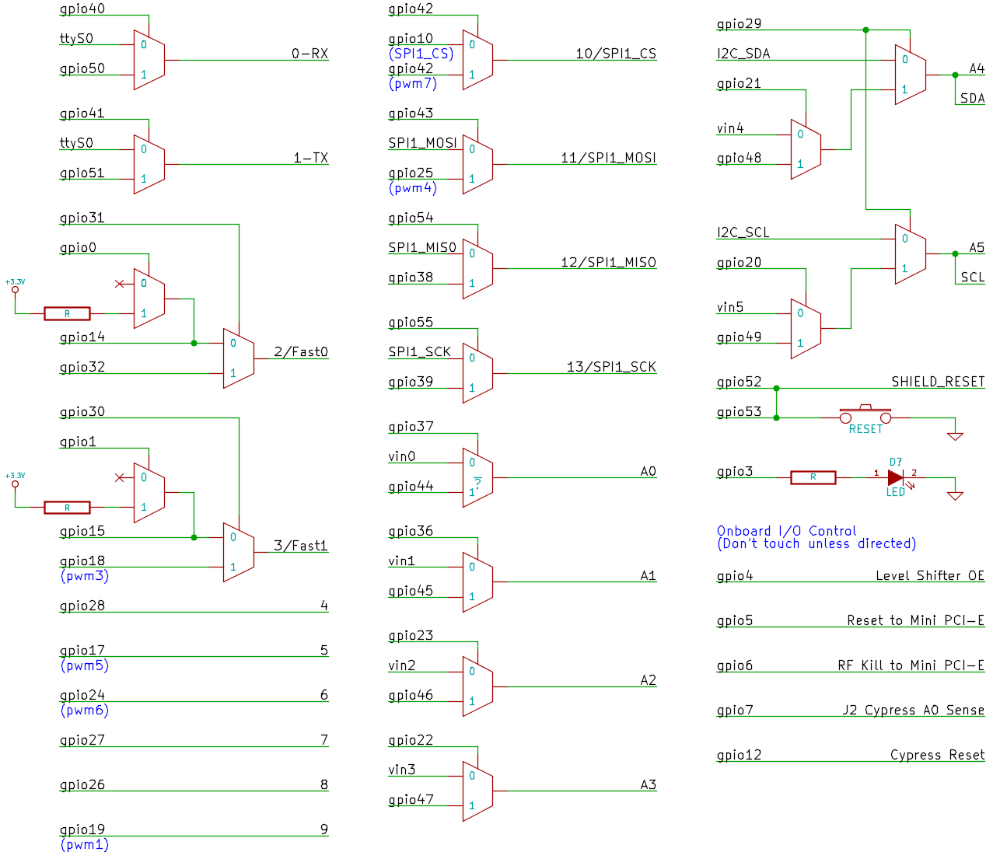

Programming GPIO From Linux
====
[原文链接](http://www.malinov.com/Home/sergey-s-blog/intelgalileo-programminggpiofromlinux)

Most of GPIO capabilities of Galileo board are exposed through Linux Sysfs interface, and can be controlled using file based I/O. I will show how to use some of these capabilities using simple shell commands. Of course instead of shell you can implement I/O using file manipulations from your program written using your favorite programming language.
	

##Digital GPIO - Sysfs Interface
###GPIO Information	 「查看GPIO信息」
The following command gives information about GPIO in the system and shows if an IO port was allocated to a module or Sysfs (user). 

	root@clanton:~# cat /sys/kernel/debug/gpio

As you can see from the output all the GPIOs of Galileo board is divided into 4 chunks:    

GPIOs 0-1 - Intel Quark X1000 - GPIO[9:8] pins. These are GPIO pins on Legacy I/O bridge. They are powered and active in S0 state only.    

GPIOs 2-7 - Intel Quark X1000 - GPIO_SUS[5:0] pins. These are GPIO pins on Legacy I/O bridge. They are powered and active in S3 (suspend) and S0 states.    

GPIOs 8-15 - Intel Quark X1000 - GPIO[7:0] pins. These are GPIO pins on GPIO controller. They are powered and active in S0 state only.   

GPIOs 16-55 - Cypress CY8C9540A I/O Expander

###Exporting a GPIO Port to Sysfs

To make GPIO port controllable from sysfs you'll need to export it. This is done by writing GPIO port number to /sys/class/gpio/export:   
「想要使用GPIP就得先到处特定的GPIO,使用完后及时返还」
 
	root@clanton:~# echo -n "27" > /sys/class/gpio/export
	
其中, 「echo -n」表示不换行输出.

###Setting GPIO Port Direction

	root@clanton:~# echo -n "out" > /sys/class/gpio/gpio27/direction
	
###Setting GPIO Port Drive Configuration
	root@clanton:~# echo -n "strong" > /sys/class/gpio/gpio27/drive
	
###Reading and Writing GPIO Port
	root@clanton:~# cat /sys/class/gpio/gpio27/value
	0
---
	root@clanton:~# echo -n "1" > /sys/class/gpio/gpio27/value
	root@clanton:~# echo -n "0" > /sys/class/gpio/gpio27/value
	
	
##Pulse-Width Modulation
###Checking the number of PWM Channels

	root@clanton:~# cat /sys/class/pwm/pwmchip0/npwm
	8

In Galileo all PWM outputs are implemented using Cypress CY8C9540A.    
It supports 8 PWM channels, but only 6 are used in Galileo. They are mapped as follows:

  Arduino Digital Pin Number ------- PWM Channel Number
  
 	3								3
 	5								5
 	6	 							6
 	9	 							1
 	10	 							7
 	11	 							4
 	
 	
###Exporting a PWM Channel to Sysfs

	root@clanton:~# echo -n "3" > /sys/class/pwm/pwmchip0/export

This is very similar to exporting GPIO above. Same as with GPIO once a port is exported a corresponding directory with control files will appear in Sysfs: /sys/class/pwm/pwmchip0/pwm3/enable in this case. And just as with GPIO when PWM port is no longer needed it should be un-exported by writing the port number to /sys/class/pwmchip0/unexport.

###Enabling PWM and Setting PWM Parameters

To enable a PWM on a port write "1" to a corresponding enable file. To disable a port write "0".

	root@clanton:~# echo -n "1" > /sys/class/pwm/pwmchip0/pwm3/enable
	
To set a PWM period write period in nanoseconds to period file. In example below it is set to 1000000 nanoseconds or 1 millisecond:
	
	root@clanton:~# echo -n "1000000" > /sys/class/pwm/pwmchip0/pwm3/period
	
To set a PWM duty cycle write its length in nanoseconds to duty_cycle file. In example below we set duty cycle to 50% (500000/1000000*100%):

	root@clanton:~# echo -n "500000" > /sys/class/pwm/pwmchip0/pwm3/duty_cycle
	
##Analog Input
Analog inputs in Galileo implemented using Analog Devices AD7298 ADC IC.    
This IC has 8 channels, but only 6 channels are connected in Galileo. The resolution of each channel is 12 bit.    
So resulting values will be in range 0 - 4095. 0 - input voltage 0V (ground), 4095 - input equals 5V (power supply).

In Sysfs analog inputs can be read from /sys/bus/iio/devices/iio:device0/in_voltageX_raw files. Since analog inputs are multiplexed with GPIO and I2C (in case of A4 and A5) it is needed to enable analog input first.    

Multiplexers are controlled using regular GPIO pins. Example below shows how to do that for A0. Refer to the table below to find out corresponding multiplexer ports for other analog ports.

	root@clanton:~# echo -n "37" > /sys/class/gpio/export
	root@clanton:~# echo -n "out" > /sys/class/gpio/gpio37/direction
	root@clanton:~# echo -n "0" > /sys/class/gpio/gpio37/value
	
First echo command exports GPIO port 37 which is used to control A0 multiplexer. Second echo command configures that GPIO for output. Third echo command connects A0 to ADC chip.

Once analog port is connected, its value can be read from Sysfs:
	
	root@clanton:~# cat /sys/bus/iio/devices/iio\:device0/in_voltage0_raw
	2593
	

##GPIO Mapping in Galileo

###测试
熄灭Galileo板子上的LED灯。
查知GPIO3控制LED灯, 
	
	echo -n "0" > /sys/class/gpio/gpio3/value
	观察灯灭
---

	echo -n "1" > /sys/class/gpio/gpio3/value
	观察灯亮	